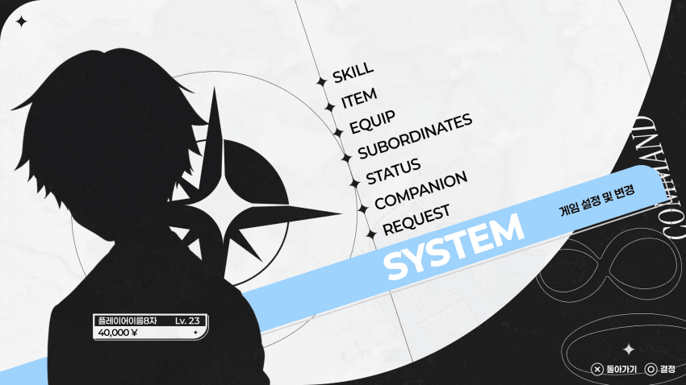
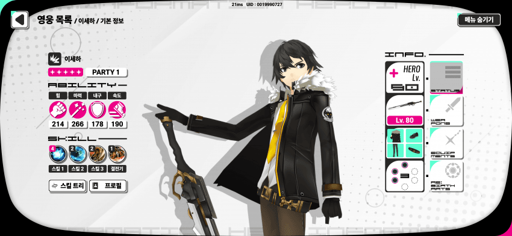
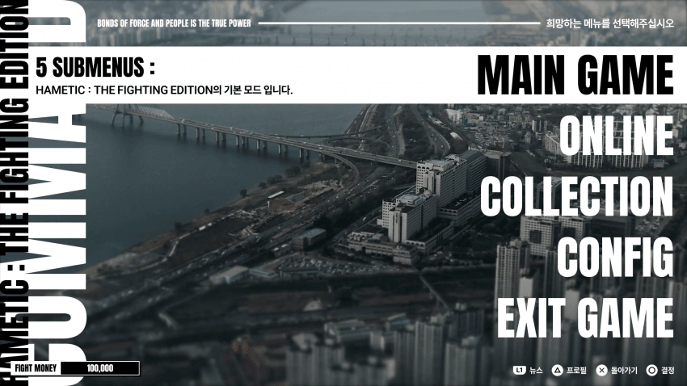

# Project VERTEX — 통합 아트 디렉션

이 문서는 프로젝트 원본 `VERTEX_Art_Direction.md`와 대화에서 제공된 이미지 레퍼런스, 현재 적용된 게임 화면을 함께 정리한다. 원문은 같은 폴더의 [VERTEX_Art_Direction.md](VERTEX_Art_Direction.md)에 보존되어 있고, 공유 이미지 복사본은 [References](References/)에 있다.

## 최상위 방향

> **차가운 백색 관측 시스템 UI + 플랫 실루엣 + 별·컴퍼스 기반 기하학 + 제한된 블루 포인트 + 실제 플레이에 필요한 높은 가독성**

VERTEX의 UI는 관측·기록·좌표·측정 장비를 연상시키는 차갑고 무정한 시스템 화면이다. 디테일한 일러스트보다 큰 면의 분할과 실루엣, 얇은 선과 기하학적 표식으로 완성도를 만든다. 정보 전달과 실제 HUD 가독성이 장식보다 우선이다.

## 레퍼런스 우선순위

새 UI를 만들 때는 아래 순서를 따른다.

1. **HAMETIC 시스템 메뉴** — 플랫 실루엣, 큰 면 분할, 별·컴퍼스 모티프, 흑백 대비, 제한된 포인트 컬러.
2. **VERTEX Event Viewer / The White Vertex 실장 이미지** — 오프화이트 바탕, 얇은 기하학 선, 좌표·로그·관측 시스템 분위기, 모서리 절단형 패널.
3. **현재 VERTEX 전투 화면** — 실제 게임 적용 기준. 정보 위계와 HUD 가독성 확인에 사용.
4. **히어로 목록형 UI** — 카드형 정보 배치와 스탯 아이콘을 업그레이드 카드 및 플레이어 스탯 HUD에 부분 적용. 둥근 패널은 이 계열에서만 선택적으로 참고.
5. **맥시미 계열 메뉴 타이포그래피** — 굵고 큰 대문자 산세리프는 타이틀·로고·메인 메뉴 같은 제한된 화면에서만 사용.

참고 이미지가 서로 다른 스타일을 보여줄 때는 이 우선순위를 유지하고, 3번의 실제 플레이 가독성 기준으로 최종 판단한다.

## 색상 체계

| 역할 | 기준 |
|---|---|
| 기본 | 오프화이트·화이트, 블랙, 중립 회색 |
| 주요 강조 | 시안·밝은 블루. 인터랙션과 선택 상태에 제한적으로 사용 |
| 기능 색 | Attack / Skill / Power 카드를 빠르게 구별하는 작은 타입 인디케이터에 사용 |
| 경고 | HP·위험·경고 등 의미가 명확한 곳에만 빨강을 소량 사용 |

모노톤이 기본이다. 포인트 컬러는 아이콘, 얇은 강조선, 선택 표시, 작은 라벨, 카드 타입 표시처럼 의미가 분명한 요소에 둔다. 기능 색이 화면 전체를 덮지 않게 한다.

## 형태와 Vertex Mark

UI는 평범한 직사각형 박스를 반복하지 않는다. 모서리가 잘린 긴 패널, 비대칭 면 분할, 얇은 이중 외곽선, 가로형 HUD 바, 태그 라벨, 좌표축 형태의 구분선, 원호·레이더 형태를 활용한다.

보조 기호는 `+`형 좌표 마커, 작은 다이아몬드, 4방향 별, 컴퍼스, 얇은 원형 눈금, 불완전한 원호, 좌표 숫자와 짧은 점선이다. 장식 요소는 정보를 앞서지 않는다.

`Assets/Art/UI/UI_VertexMark_CompassVoid_Concept01_Trim.png`는 프로젝트의 핵심 마크다. 로고 하나에 한정하지 않고 메뉴 헤더, 버튼 장식, 구분자, 로딩 표시, 현재 위치, 패널 코너, 상태 심볼, 맵 장식 등 UI 전반의 기하 모티프로 쓴다. 크기를 과하게 키우거나 기능 아이콘과 혼동시키지 않는다. 변형할 때도 4방향 별·컴퍼스의 기본 실루엣을 유지한다.

## 패널과 버튼

- **큰 패널:** 오프화이트 채움, 얇은 검정 테두리, 일부 모서리 컷. 한쪽에 Vertex Mark 또는 작은 좌표 표식을 두고 강조 상태에서 시안 선을 추가할 수 있다.
- **작은 라벨:** 짧은 사각형 안에 짧은 텍스트와 작은 별·다이아몬드를 둔다.
- **상태 패널:** 아이콘과 큰 숫자를 우선 배치하고, 얇은 분할선과 작은 영문 시스템 라벨을 보조로 쓴다. 필요한 경우 시안 강조선을 쓴다.
- **버튼:** 긴 가로형, 절단 모서리, 왼쪽 기능 아이콘, 중앙 텍스트, 오른쪽 Vertex 계열 별 장식. Hover에서 시안을 강조한다.
- 장식선과 프레임이 카드나 캐릭터 실루엣을 침범하지 않게 한다.

## 타이포그래피

타이틀과 로고에는 매우 굵은 대문자 산세리프와 큰 스케일을 쓸 수 있다. HAMETIC·맥시미 메뉴의 강한 대비를 참고하되 타이틀 화면, 메인 메뉴, 대형 챕터 제목, 결과 제목에 한정한다.

게임플레이 UI는 간결한 산세리프와 작은 시스템 라벨을 사용한다. 수치 가독성을 우선하고, 필요하면 자간을 조금 넓혀 기계적·관측 시스템의 인상을 준다. 큰 제목용 글자 스타일을 HUD 전반에 남용하지 않는다.

## 전투 HUD — 실제 플레이 기준

전투 HUD의 최우선 목표는 한눈에 읽히는 것이다. VERTEX의 밝은 백청색 배경 위에서 UI가 묻히지 않도록 명도 대비를 확보한다. 밝은 면만으로 부족하면 검정 외곽선이나 반투명한 어두운 면을 함께 쓴다.

필수 정보는 플레이어 HP, 적 HP, 에너지, 탄약, 현재 무기, 버프·디버프, 적 Intent, 아이템, 카드 손패, End Turn, Map·Deck 접근 기능이다. 숫자는 즉시 읽혀야 하고 상태 변화는 장식보다 먼저 보여야 한다. 전투 화면 중앙은 캐릭터와 적을 위해 가능한 한 비워둔다.

목표는 예쁜 화이트 UI 자체가 아니라 **실제 전투에서 빠르게 읽히는 화이트 UI**다. 적 방어도 같은 지속 수치는 아이콘과 충분히 큰 숫자로 표시하고, HP와 기능이 시각적으로 혼동되지 않게 한다.

## 화면별 적용

### Event Viewer

현재 실장 화면을 핵심 기준으로 삼는다. 좌측에는 큰 상징·사건 이미지·기하 패턴을, 우측에는 사건 제목과 설명을 둔다. 하단이나 우측에는 긴 선택지 버튼을 배치하고 좌표·로그·관측 표식을 보조로 쓴다.

### Map

배경을 가리는 UI를 최소화하고 노드와 경로를 우선한다. 현재 위치에는 Vertex Mark 계열 마커를 사용할 수 있다. 좌표·방위·챕터 정보는 작은 패널로 보완한다.

### Shrine / Companion Selection

캐릭터를 중심에 두고 UI는 얇고 평면적으로 배치한다. 카드형 상세 정보 레이아웃을 참고해 패시브, 고유 카드, 역할을 아이콘 중심으로 정리한다.

### Title / Main Menu

굵고 큰 대문자 타이포, 과감한 실루엣과 면 분할, 큰 Vertex Mark를 사용할 수 있는 화면이다.

## 제작 우선순위

1. 공용 UI 키트: 큰·작은 패널, 헤더 바, 가로 버튼, 태그, 구분선, Vertex 장식, 선택·Hover 표시.
2. 전투 HUD: 플레이어·적 HP 프레임, 에너지, 탄약, 무기, 상태 슬롯, Intent, End Turn.
3. 이벤트 UI: 헤더, 선택 버튼, 로그·좌표 장식, 이미지 프레임.
4. 맵 UI: 노드 프레임, 현재 위치 마커, 챕터·층 라벨, 맵 유틸리티 버튼.
5. Shrine / 동료 UI: 선택 카드, 패시브 패널, 고유 카드 미리보기, 확인 버튼.
6. 타이틀·메뉴·로딩: 메인 메뉴, 로고 구성, Vertex Mark 로딩 애니메이션.

## 기본 UI에서 피할 것

실사 항공 사진 합성, 만화 잉크 일러스트, 과한 금속·유리·홀로그램 질감, 두꺼운 네온 글로우, RGB 다색 사이버펑크 UI, 지나친 그라디언트, 그림자·베벨·3D 버튼, 판타지 장식 프레임, 의미 없는 복잡한 HUD, 정보보다 장식이 앞서는 구성을 기본 스타일로 사용하지 않는다.

## 제공된 이미지

처음 지정된 핵심 레퍼런스 세 장은 원본 첨부 순서대로 표시했다. 다른 첨부는 로고·이벤트 화면·HUD·지도·축복·방어도 사례별로 목록화했다. 모두 `References/`의 파일명과 연결되어 있다.

| 핵심 레퍼런스 | 이미지 |
|---|---|
| Reference 01 |  |
| Reference 02 |  |
| Reference 03 |  |

## 프로젝트 내 적용 예시

- 핵심 마크: [CompassVoid](../Assets/Art/UI/UI_VertexMark_CompassVoid_Concept01_Trim.png)
- 가로 지도 배경: [UI_Map_WhiteVertex_Panorama](../Assets/Art/Maps/UI_Map_WhiteVertex_Panorama.png)
- 전투 노드: [UI_MapNode_Combat_WhiteVertex](../Assets/Art/Maps/Nodes/UI_MapNode_Combat_WhiteVertex.png)
- 축복 노드: [UI_MapNode_Blessing_WhiteVertex](../Assets/Art/Maps/Nodes/UI_MapNode_Blessing_WhiteVertex.png)
- 상점 노드: [UI_MapNode_Shop_WhiteVertex](../Assets/Art/Maps/Nodes/UI_MapNode_Shop_WhiteVertex.png)
- 상태 툴팁: [UI_StatusTooltip_WhiteVertex](../Assets/Art/UI/UI_StatusTooltip_WhiteVertex.png)
- 적 방어도 배지: [UI_EnemyBlockBadge_WhiteVertex](../Assets/Art/UI/UI_EnemyBlockBadge_WhiteVertex.png)
- 방어 획득 효과: [BlockGainShield_ArtDirection](../Assets/Art/VFX/BlockGainShield_ArtDirection.png)

